# Test
1. run:
    ```
    docker-compose up -d
    ```
    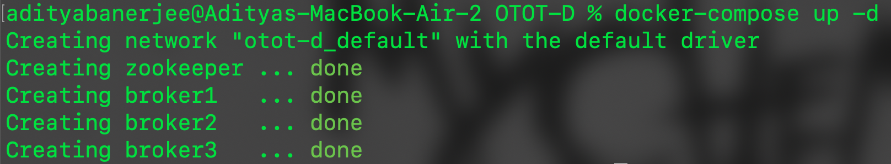
2. create a topic by running:
    ```
    docker exec broker1 kafka-topics --create --topic test-topic --bootstrap-server broker1:19092 --replication-factor 3
    ```
    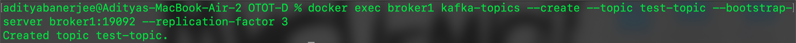
3. start a producer by running:
    ```
    docker exec --interactive --tty broker1 kafka-console-producer --topic test-topic --bootstrap-server broker1:19092
    ```
    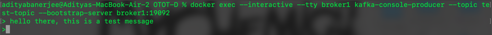
4. start a consumer by running (in a separate terminal):
    ```
    docker exec --interactive --tty broker1 kafka-console-consumer --topic test-topic --bootstrap-server broker1:19092 --from-beginning
    ```
    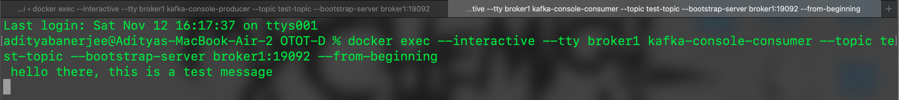
5. check the leader of the partition by running:
    ```
    docker exec broker1 kafka-topics --topic test-topic --bootstrap-server broker1:19092 --describe
    ```
    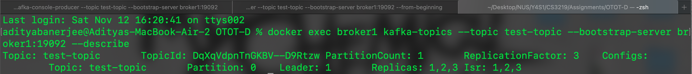
    - observe that broker1 is the leader of the partition
6. stop container of leader broker using docker/docker desktop (simulate leader failure)
    - in this case it is ID 1 (broker1)
    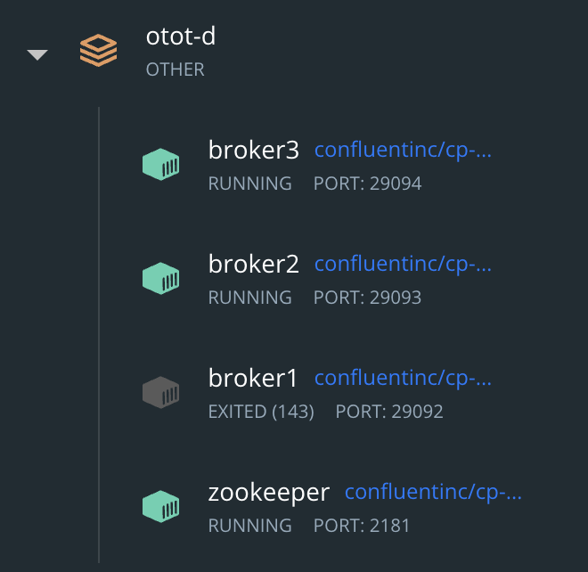
7. check the new leader of the partition by running:
    ```
    docker exec broker2 kafka-topics --topic test-topic --bootstrap-server broker2:19093 --describe
    ```
    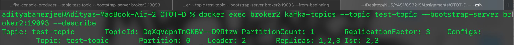
    - observe that broker2 is the now the leader of the partition
8. start the producer again by running:
    ```
    docker exec --interactive --tty broker2 kafka-console-producer --topic test-topic --bootstrap-server broker2:19093
    ```
    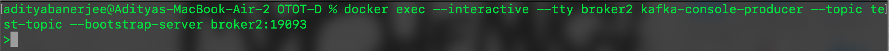
9. start the consumer again by running:
    ```
    docker exec --interactive --tty broker2 kafka-console-consumer --topic test-topic --bootstrap-server broker2:19093 --from-beginning
    ```
    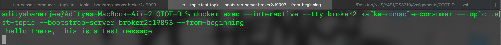
    - observe that previous messages have persisted
10. verify that messages can still be sent
    - producer:
    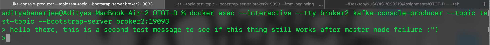
    - consumer:
    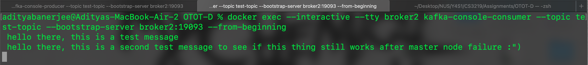
